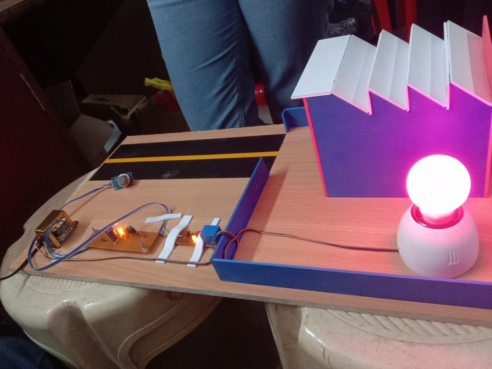

# Industrial Pollution Monitoring System

A hardware-based system that automatically cuts off industrial power
when CO2 pollution exceeds safe limits.

---

## 🔍 Problem Statement

Industrial units emit harmful CO2 gases. Continuous emission beyond
safe levels damages the environment and human health. Manual monitoring
is unreliable. This system automates the shutdown process.

---

## ⚙️ How It Works

1. CO2 sensor continuously monitors pollution levels
2. When CO2 exceeds threshold → sensor sends signal to relay
3. Relay triggers → industrial load (bulb) powers OFF automatically
4. When levels normalize → power restores

---

## 🧩 Components Used

| Component | Purpose |
|-----------|---------|
| CO2 Sensor | Detects carbon dioxide levels |
| Relay Module | Switches industrial load ON/OFF |
| Step-down Transformer | Converts AC mains to low voltage |
| Rectifier + Filter Circuit | Converts AC to DC |
| 5V Regulator | Stable power supply to circuit |
| Electric Bulb | Represents industrial load |
| Capacitors, Diodes, Resistors | Supporting circuit components |

---

## 🔌 Block Diagram

CO2 Sensor → Relay Interface → Industrial Load
↑
Step-down Transformer → Rectifier & Filter → 5V Regulator

---

## 📸 Project Demo

---

## ✅ Key Results

- Automatic power cutoff when CO2 exceeds safe threshold
- Reduces environmental damage from industrial emissions
- No manual intervention required
- Reduces health risk to workers near pollution sources

---

## 👩‍💻 Author

**Shaik Madiha** — ECE Graduate, Proudhadevaraya Institute of Technology  
[LinkedIn](https://linkedin.com/in/shaik-madiha-23996927b) | 
[Portfolio](https://shaik-madiha29.github.io/Madiha-Portfolio/)
